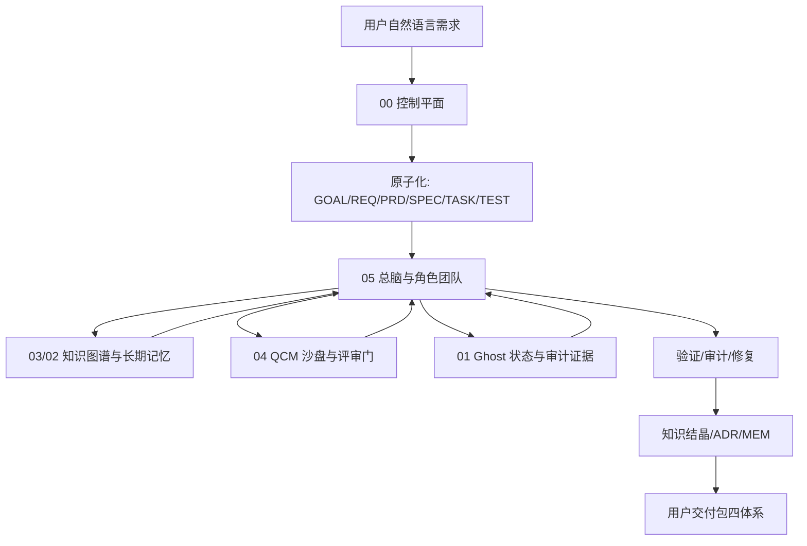

# Mother Pack Sandbox Replay

> 沙盘主题：如何让母交付包真正帮助开发者与通用 AI 大模型协同开发，并避免降智、混乱、漂移、任务堆死和无休止重构。  
> 输入来源：本轮对话、当前母交付包结构、三位侧翼审计员的只读分析。

## 1. 用户真实意图复盘

用户要的不是普通交付包，也不是提示词合集，而是一套能长期协同开发 AI 应用项目的母系统：

- 开发者先拿到母交付包。
- 开发者使用母交付包与通用 AI 大模型协同开发具体项目。
- 协同过程中要控制需求、规格、任务、记忆、审计、验证、交付。
- 最终开发者把用户交付包压缩给最终用户。
- 用户交付包必须体现项目的价值体系、功能体系、结构体系、运作体系。

核心痛点：

```text
自然语言开发很方便
  但长对话、多任务、持续加功能后
  容易出现需求漂移、规格漂移、记忆丢失、结构混乱、幻觉完成
  最后变成反复重构和修复
```

## 2. 角色团队

| 角色 | 立场 | 本轮判断 |
|---|---|---|
| 00 总控协调官 | 控制流程 | 必须把提示词工程升级为开发操作系统 |
| 05 平台主权者 | 治理边界 | 母包和用户包必须强边界 |
| 05 运营总监 | 需求与版本 | 新需求进入队列，不能直接堆到当前任务 |
| 05 体系协调官 | 工具协同 | LSP/MCP/插件/Skill 要作为能力，不是零散调用 |
| 05 首席架构师 | 架构规格 | PRD/SPEC/TEST 必须形成追踪矩阵 |
| 05 风险审计员 | 反方审查 | 没有证据不能说完成，沙盘不能替代测试 |
| 03 知识管理员 | 知识图谱/记忆 | 需要区分图谱、记忆、交接、聊天记录 |
| 01 通讯协议员 | 状态同步 | Ghost Channel 适合承载状态、审计、快照和因果顺序 |
| 04 QCM 沙盘员 | 共识与涌现 | QCM 适合做多角色评估和阶段门，不可当作万能证明 |

## 3. 第一轮：乐观方案

乐观视角认为：现有母包已经具备足够强的拼图。

```text
00 已有路由/上下文/工作流/评估
05 已有角色/总脑/API/任务/验证
03/02 已有知识图谱/记忆/MCP
01 已有同步/审计/Schema/快照
04 已有沙盘/投票/死锁/SRS/飞轮
```

最快路线：

1. 把 00 定义为控制平面。
2. 把 05 定义为主集成层。
3. 把 03/02 定义为知识和记忆层。
4. 把 01 定义为状态与证据层。
5. 把 04 定义为沙盘与涌现评估层。
6. 把用户交付包定义为最终成果层。

乐观结论：不用重做所有系统，先建立统一工件流和阶段门，就能显著减少混乱。

## 4. 第二轮：悲观审计

风险审计员指出：

- 现有文档多，容易让 AI 误读旧报告。
- 05 内部有 archive/legacy，不能当主管线。
- 03 有 `07-项目文档` 和 `docs/superpowers` 两套落点，需要明确权威位置。
- 01 的文档与验证报告存在时间线冲突，必须以当前验证为准。
- 04 的 R 值和涌现演示不能代表真实开发团队已经涌现。
- 如果 00 增加太多协议，会造成上下文膨胀，反而降低效率。
- 若没有注册表和追踪矩阵，所有结论仍会回到人工记忆。

悲观结论：真正缺的是统一状态对象、注册表、追踪矩阵和验证门，不是更多口号。

## 5. 第三轮：实用主义收敛

实用主义方案：

```text
先轻量文件化
再脚本化
再 MCP/API 化
最后才状态总线化
```

不要一开始就强行把 01/03/04/05 全部深度集成。先让开发者和通用 AI 能稳定使用一组明确文档：

- `ATOMIC-AI-DEVELOPMENT-OPERATING-SYSTEM.md`
- `TRACEABILITY-MATRIX-TEMPLATE.md`
- `ANTI-DRIFT-PROTOCOL.md`
- `AI-ROLE-TEAM-SANDBOX.md`
- `MOTHER-PACK-AI-COLLABORATION-BLUEPRINT.md`

然后再补静态注册表：

```text
PROJECT_REGISTRY.yaml
CAPABILITY_REGISTRY.yaml
ARTIFACT_REGISTRY.yaml
VALIDATION_REGISTRY.yaml
```

实用结论：用“文档 + ID + 验证 + 交接”先让协作稳定，再逐步自动化。

## 6. 最终推荐架构



## 7. 最佳工作流

```text
1. Intake
   识别用户真实目标、目标用户、场景、不做范围。

2. Atomic
   生成 GOAL/REQ/PRD/SPEC/TASK/TEST ID。

3. Context
   生成最小 Context Pack，不吞整个母包。

4. Sandbox
   重大任务启动角色团队沙盘：开发者、架构师、审计员、知识管理员、协调官。

5. Execute
   用 05 调度角色/技能，用 03 查知识，用 MCP/LSP/插件执行。

6. Evidence
   用测试、命令、文件引用、审计记录证明结果。

7. Memory
   P0/P1 决策写入 ADR/MEM/知识图谱，不塞满长期记忆。

8. Delivery
   更新用户交付包价值/功能/结构/运作四体系。
```

## 8. 当前必须优先落地的事项

| 优先级 | 事项 | 原因 |
|---|---|---|
| P0 | 固化母包/用户包边界 | 避免交付对象混乱 |
| P0 | 原子 ID 和追踪矩阵 | 防止需求、规格、任务断链 |
| P0 | 反漂移协议 | 防止持续加功能导致失控 |
| P1 | 注册表文件 | 让 AI 快速知道能力、入口、验证 |
| P1 | Context Pack 增强 | 每次协作都有相同输入格式 |
| P1 | 沙盘角色团队 | 复杂任务前暴露盲点 |
| P2 | 03 MCP 检索接入 | 让 AI 不靠记忆找资料 |
| P2 | 05 TaskManager/验证门接入 | 让任务状态可持续 |
| P3 | 01 Ghost 状态总线 | 多 AI 并行后再需要 |
| P3 | 04 QCM 指标自动化 | 先手动沙盘，再自动评分 |

## 9. 最终裁决

最佳方案不是把所有能力一次性集成成庞大平台，而是先建立一条稳定的开发证据链：

```text
需求有编号
规格有契约
任务有状态
执行有边界
验证有证据
审计有修复
决策有记忆
交付有四体系
```

这条链稳定后，通用 AI 大模型就能成为强协作者，而不是在长对话中逐渐混乱的临时生成器。
