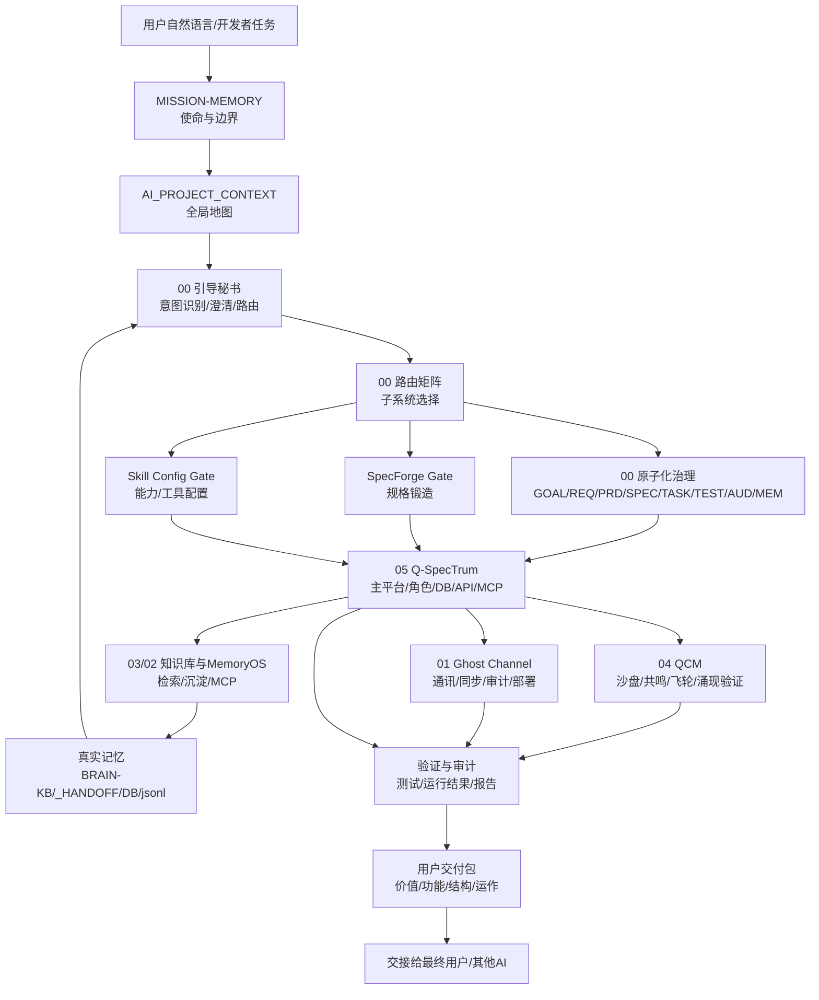

# Mother / Child Package Workflow Map

> 中文名：母包/子包齿轮咬合图。  
> 用途：把每个文件夹在数据工作流、业务工作流、运行工作流、记忆工作流、交付工作流中的位置讲清楚。  
> 当前状态：第一轮审计基线，基于入口文档、文件清单和关键运行入口扫描；后续需逐文件深读和注册表化。

## 1. 总体齿轮图



## 2. 工作流总线

| 总线 | 上游 | 处理层 | 下游 | 当前证据 | 主要缺口 |
|---|---|---|---|---|---|
| 自然语言入口 | 用户/开发者 | `MISSION-MEMORY` + `00/12` 引导秘书 | 路由矩阵、上下文包 | 根使命文档、Guide Secretary、Routing、`PROJECT_REGISTRY.yaml` 已存在 | `PROJECT_REGISTRY.yaml` 仍需补来源行号、当前任务状态和自动校验 |
| 需求到规格 | 自然语言想法 | SpecForge + 原子化治理 | PRD/SPEC/TASK/TEST | `00/06` 有 Spec Gate 与追踪模板 | 缺实际项目级 `TRACEABILITY-MATRIX.md` 实例 |
| 能力到工具 | 功能需求 | Skill Config Gate + Capability Contract | Skill/MCP/LSP/插件/脚本 | `00/10` 有能力卡与评估门，`CAPABILITY_REGISTRY.yaml` 已有初版 | 缺每项能力的来源行号、失败处理、权限边界和当前验证证据 |
| 知识到记忆 | 文档/代码/对话结论 | `03` MemoryOS/MCP、`05` BRAIN-KB | 真实记忆、检索、handoff | `.db`、`.jsonl`、BRAIN-KB、MCP servers 存在 | 缺跨 `03/05` 的统一记忆索引 |
| 沙盘到验证 | 复杂方案 | `04` QCM + `00/08` 角色沙盘 | 风险、方案、测试计划 | QCM 测试、沙盘文档存在 | 沙盘结果与验证结果需统一绑定 |
| 平台运行 | 开发/查询/协作任务 | `05` Q-SpecTrum | Web/API/MCP/DB/角色输出 | `run.py`, `api_server.py`, `qspectrum_mcp_server.py`, `verify-integration.py` | `requirements.txt` 与 `pyproject.toml` 依赖叙述需统一 |
| 通讯同步 | 多智能体/多系统状态 | `01` Ghost Channel | Delta、VectorClock、Audit、部署 | VERIFY、SDK、schema、Docker 存在 | 与 `05` 的正式调用边界需能力登记 |
| 最终交付 | 已完成项目成果 | 子包四体系 | 最终用户/其他 AI | 子包 README、组装规则与 `VERIFY-DELIVERY.ps1` 存在；模板模式与 Strict 模式当前均 0 failures / 0 warnings | 缺具体项目实例业务 smoke/test；Strict 是结构/交接门，不等于业务运行门 |

## 3. 子系统齿轮

### 3.1 Root：全局入口

```text
MISSION-MEMORY.md
  -> AI_PROJECT_CONTEXT.md
  -> 开发者母交付包使用说明.md
  -> 00.超级提示词工程/README.md
```

职责：

- 固定母包使命和身份边界。
- 固定母包/子包边界。
- 防止硬编码本机路径。
- 告诉后续 AI 先读什么、如何确认理解。

风险：

- 根目录已建立初始机器可读注册表、统一状态账本和记忆源索引，但字段级来源、失败处理和自动校验仍需继续补齐。

### 3.2 `00.超级提示词工程`：控制平面

数据流：

```text
用户意图
  -> 使命唤醒
  -> 引导秘书
  -> 路由矩阵
  -> 路由反馈
  -> Context Pack
  -> 统一状态对象
  -> 阶段门/子系统
  -> 验证与交接
```

业务流：

```text
想法 -> GOAL -> REQ -> PRD -> SPEC -> TASK -> TEST -> AUD -> MEM -> 用户交付包
```

运行流：

- 主要是提示词/协议运行，不是独立程序。
- 必须绑定真实命令和真实文件，不允许只输出话术。

当前强点：

- 已吸收 QCM、SpecForge、Skill Config、MetaIntelligence，并做了批判性降级。
- 已明确不覆盖通用 AI 自身系统逻辑。

当前缺口：

- 全链路审计、注册表和覆盖表需要成为固定入口。

### 3.3 `01.通讯协议_幽灵通道`：通讯/同步齿轮

数据流：

```text
状态/记忆/工作流步骤
  -> DeltaPayload / EncryptedStream / VectorClock
  -> SyncResult / AuditEntry / SnapshotRecord
```

业务流：

- 支持多智能体之间的状态同步、因果一致、审计与恢复。
- 更适合作为底层协议能力，不应被用户交付包无差别暴露。

运行流：

- `VERIFY.ps1`
- SDK 测试、Docker/企业部署、OpenAPI/商业部署材料。

咬合点：

- 上游来自 `05` 或未来多智能体平台。
- 下游输出同步结果、审计记录、部署能力。

缺口：

- 需要在 `CAPABILITY_REGISTRY.yaml` 中登记 Ghost Channel 的调用边界、权限、输入输出。

### 3.4 `02.通用知识库框架_Universal-KB`：轻模板齿轮

数据流：

```text
01-raw -> 02-processed -> 03-wiki -> 04-memory -> 05-agents -> 06-output
```

业务流：

- 给新项目快速建立知识库结构。
- 更像模板和规范，不是主运行时。

咬合点：

- 可被用户交付包选用为轻量知识库模板。
- 与 `03` 的应用版存在继承关系。

缺口：

- 与 `03` 的职责边界需要在注册表中写清：模板 vs 可运行应用。

### 3.5 `03.数据库管理_文件夹整理AI应用`：知识/MCP齿轮

数据流：

```text
文件/收件箱/文档
  -> ingest / index / vector search
  -> .workbuddy/index/search_index.db
  -> MemoryOS / jsonl / wiki
```

业务流：

- 文件治理、知识检索、项目知识沉淀、MCP 工具调用。

运行流：

- `python verify_install.py`
- `python app.py --port 5000`
- `python mcp_server.py`
- `$env:PYTHONUTF8='1'; $env:PYTHONIOENCODING='utf-8'; pytest tests/ -q`

咬合点：

- 给 `00` 和 `05` 提供真实检索/记忆/MCP能力。
- 给未来 AI 提供“别靠聊天记忆，先查真实知识库”的落点。

缺口：

- 当前与 `05/BRAIN-KB` 的双记忆源没有统一读写优先级和冲突解决表。
- `.env` 缺失会影响高级 AI 调用，必须在交付时作为可选配置说明。
- Windows 默认编码会影响 MCP 集成测试子进程输出解析；验证命令必须显式设置 UTF-8 环境。
- 历史报告和迁移计划曾残留旧本机路径，本轮已把可执行示例替换为占位路径；后续扫描仍需区分真实泄漏和故意测试样本。

### 3.6 `04.QCM-MVP-Emergence`：沙盘/涌现齿轮

数据流：

```text
角色/消息/状态
  -> 共鸣公式 R
  -> 沙盘/飞轮/协作模块
  -> 涌现/阻塞/能力成长报告
```

业务流：

- 复杂方案推演、角色协作、风险预判、飞轮迭代。

运行流：

- `python "02-代码编写/test_qcm_all.py"`
- `pytest test_roles/test_collaboration/test_sandbox/test_flywheel/test_summoning -q`
- `python qcm/main.py`
- `python health_check.py` 需要单独解释其语义阈值。

咬合点：

- `00/08` 角色沙盘可以调用 QCM 作为推演思想来源。
- `05` 可吸收 QCM 角色、公式和工作流概念。

缺口：

- 沙盘输出必须明确“不是验证结果”，需要绑定 TEST/AUD 才能进入交付。

### 3.7 `05.超极智脑_Q-SpecTrum`：主运行齿轮

数据流：

```text
用户请求
  -> Secretary / routing
  -> QSpectrumDB / KnowledgeResonance / PromptBuilder
  -> LLMProvider / roles / API / MCP
  -> project_memory / BRAIN-KB / platform DB / handoff
```

业务流：

- 角色协作、知识检索、任务处理、API/Web 交互、长期知识沉淀。

运行流：

- `python verify-integration.py`
- `$env:PYTHONUTF8='1'; python run.py --status`
- `python run.py --web`
- `python run.py --query "你的问题"`
- `python qspectrum_mcp_server.py`

咬合点：

- 是母包当前最接近“运行总脑”的子系统。
- `00` 负责启动和治理；`05` 负责平台运行和角色/记忆/API。

缺口：

- 需要把 `00` 的使命唤醒和 `05` 的 Brain Protocol 启动顺序建立显式桥接。
- 依赖声明存在文档漂移，需要统一。

### 3.8 `协同通用AI大模型开发交付包`：用户交付齿轮

数据流：

```text
母包开发成果
  -> 项目筛选/清理/验证
  -> 价值体系/功能体系/结构体系/运作体系
  -> 最终用户可理解、可运行、可验收的包
```

业务流：

- 把开发者生产系统变成最终用户成果系统。

运行流：

- `powershell -ExecutionPolicy Bypass -File .\VERIFY-DELIVERY.ps1`：模板/基础检查，当前通过。
- `powershell -ExecutionPolicy Bypass -File .\VERIFY-DELIVERY.ps1 -Strict`：最终项目交付检查，当前通过，0 failures / 0 warnings。

缺口：

- 后续新项目内容变更后，仍需保持项目实例级 `AI_PROJECT_CONTEXT.md`、`CHANGELOG.md`、`HANDOFF.md`、`TRACEABILITY-MATRIX.md`、`VALIDATION_REPORT.md` 同步。
- 严格模式当前是最终交付门：它防止开发者把模板骨架误当成最终用户交付包。

审计补充：

- `01` 的 `VERIFY.ps1` 是 manifest/integrity 校验，不等同于 SDK 全测试；进入用户交付包时必须另附对应 SDK/项目测试命令。
- `02` 当前应定位为知识库模板，不应承诺完整可运行应用，除非后续补齐 ingest/query/lint/verify 脚本。
- `04` 沙盘/QCM 输出应进入 `validation_plan` 或 `TEST/AUD` 后才能影响交付判断，不能把 R 值或沙盘叙述直接当验收通过。

## 4. 标准执行顺序

任何未来 AI 或开发者进入母包后，建议固定执行：

```text
1. 使命唤醒：MISSION-MEMORY.md
2. 全局地图：AI_PROJECT_CONTEXT.md
3. 控制平面：00/README + MASTER + MODEL-NATIVE + GUIDE + ROUTING
4. 审计协议：00/14 Full-Stack Workflow Audit
5. 阶段门判断：SpecForge / Skill Config / Anti-Drift / Role Sandbox
6. 子系统最小上下文：只读必要 README/INDEX/AGENTS/HANDOFF/代码入口
7. 执行或修改：声明改动半径
8. 验证：运行对应命令
9. 记忆/交接：写入真实文件或数据库
10. 子包装配：只抽取最终用户需要的成果
```

## 5. 第一轮结论

当前母包的体系方向合理，而且已经有大量可运行齿轮；但要达到“自然语言进入后真正自动协同”的目标，还不能只靠叙述性 Markdown。当前已经建立四类机器可读或半机器可读索引的初始版：

```text
PROJECT_REGISTRY.yaml       # 当前项目/子系统状态
CAPABILITY_REGISTRY.yaml    # 能力、工具、Skill、MCP、LSP、插件
ARTIFACT_REGISTRY.yaml      # 关键文档、代码、DB、交付物
VALIDATION_REGISTRY.yaml    # 每个子系统和交付包的验证命令
MEMORY-SOURCE-PRIORITY.md   # 多记忆源读取、写入、冲突解决规则
MEMORY-SOURCE-INDEX.yaml    # 多记忆源机器可读权威范围和冲突 owner
UNIFIED-STATUS-OBJECT-SPEC.md
UNIFIED-STATUS-LEDGER.yaml
BREAKPOINT-REPAIR-MATRIX.md # 显式/隐蔽断裂点修复矩阵
```

下一步要把这些初始注册表从“可读索引”升级为“可校验调度依据”：为每条记录补来源行号、当前验证证据、责任边界、失败处理、路由反馈和下游交付物。
