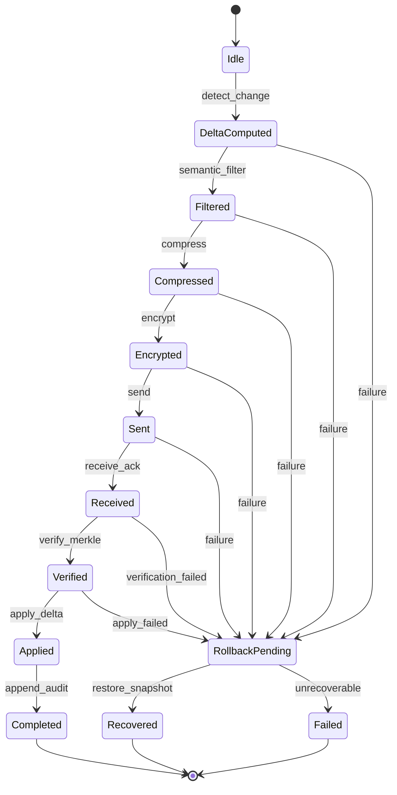

---
entity_type: standard
title: 幽灵通道协议规范稿_SDK草案_v1.0
created_at: 2026-04-05
updated_at: 2026-04-05
status: active
tags:
  - standard
---

# 幽灵通道协议规范稿 / SDK 草案

## Ghost Channel Protocol Specification / SDK Draft

**版本**: v1.0 (FullMasterSpec)  
**日期**: 2026-04-05  
**定位**: 完整版母本，兼顾协议标准、工程实现、AI 可执行  
**适用对象**: 协议工程师、基础设施工程师、AI Agent / Workflow 开发者、系统架构师、AI 模型本身  

---

## 0. 文档使用说明

本文件是幽灵通道协议的**完整版母本**。它同时承担三类职能：

1. **协议规范**：定义协议的边界、对象、状态、消息、错误与约束。
2. **SDK 草案**：给出最小可执行实现、模块划分、接口原型与接入模式。
3. **AI 执行手册**：给出机器可读规则，使 AI 模型可直接依据本规范执行同步、恢复、审计与优化操作。

本规范遵循以下写作原则：

- **颗粒化**：每个能力尽可能拆到最小可独立验证单元。
- **原子化**：每个协议原语只承担一个明确职责。
- **结构化**：所有对象、流程、错误与约束均采用统一格式表达。
- **复盘化**：所有执行行为必须具备审计与回放能力。
- **多维度**：同时覆盖性能、一致性、安全、语义、可恢复性、可扩展性与可治理性。
- **双读者兼容**：既面向人类工程师，也面向机器执行代理。

### 0.1 阅读路径

不同读者可按以下路径阅读：

| 读者 | 推荐起点 | 推荐路径 |
|------|---------|---------|
| 协议工程师 | 第 2 部分 | 2 → 3 → 4 → 5 → 7 |
| SDK 开发者 | 第 5 部分 | 5 → 6 → 7 → 8 |
| AI 模型 | 第 6 部分 | 6 → 3 → 4 → 8 |
| 架构师 | 第 1 部分 | 1 → 2 → 4 → 8 → 9 |
| 研究者 | 第 1 部分 | 1 → 2 → 8 → 9 |

---

# Part I 协议定义层

## 1. 设计目标与非目标

### 1.1 设计目标

幽灵通道协议（Ghost Channel / Phantom Channel Protocol）的设计目标是为分布式 AI 协作系统提供一个统一的**状态同步、语义对齐、因果协调与信任验证层**。具体目标如下：

### G1 增量同步
- 仅传输必要变化，而非全量状态。
- 将同步负载从“完整快照复制”转为“结构化差分传输”。
- 目标指标：在典型场景下实现 ≥80% 带宽降低。

### G2 语义对齐
- 不仅同步数据，还同步变化的“意义”。
- 支持跨角色、跨技能、跨数据库、跨模态的语义一致性。
- 目标指标：语义检索 Precision@10 ≥ 90%。

### G3 因果一致性
- 对异步事件建立偏序关系，避免状态逆序覆盖。
- 支持冲突检测、回滚与工作流恢复。
- 目标指标：因果违规率 = 0，冲突率 ≤0.1%。

### G4 安全与最小暴露
- 对传输载荷进行端到端保护。
- 降低中间节点窥视与重放风险。
- 支持未来后量子安全升级。

### G5 可验证与可审计
- 所有关键同步操作均可生成审计轨迹。
- 所有状态变化都可通过完整性结构验证。
- 目标指标：完整性验证通过率 100%。

### G6 工程可落地
- 支持最小实现、标准实现与企业实现三级落地路径。
- 支持 Python 与 TypeScript 双语言 SDK 草案。
- 支持被 AI 模型作为机器规范直接读取执行。

### 1.2 非目标

为避免协议边界膨胀，以下内容**不属于**本协议的直接目标：

1. 不负责替代底层数据库。
2. 不负责替代消息中间件。
3. 不直接承担业务逻辑。
4. 不保证所有冲突都能自动语义融合。
5. 不保证当前版本具备完整后量子安全或零知识证明生产能力。

---

## 2. 术语、定义与边界

### 2.1 核心术语

| 术语 | 英文 | 定义 |
|------|------|------|
| 幽灵通道 | Ghost Channel / Phantom Channel | 面向分布式 AI 系统的语义感知增量同步协议层 |
| 差分载荷 | Delta Payload | 两个状态快照之间最小变化集合 |
| 因果时钟 | Vector Clock | 用于描述事件偏序关系的时间结构 |
| 审计条目 | Audit Entry | 对一次同步事件的结构化记录 |
| 语义过滤 | Semantic Filtering | 基于语义相关性筛选需要同步的变化 |
| 自愈恢复 | Self-Healing Recovery | 基于最近一致快照的自动恢复机制 |
| 信任流 | Trust Flow | 用于验证同步真实性、完整性与权限合法性的链路 |

### 2.2 系统边界

幽灵通道位于：

```
上层: 角色 / 技能 / 工作流 / 模型 / 业务模块
中层: 幽灵通道协议层
下层: 数据库 / 队列 / API / 对象存储 / 文件系统
```

它负责的不是“执行业务”，而是保障上层业务模块在分布式协作中维持一致、可信、低冗余的状态流。

### 2.3 不变量（Invariants）

以下条件必须在任何实现中保持成立：

1. **I1**：任意一次同步必须可被唯一标识。
2. **I2**：任意一次同步必须生成可审计记录。
3. **I3**：若状态已应用，则其完整性验证必须可重现。
4. **I4**：任何事件的因果顺序判断必须可解释。
5. **I5**：任何自动冲突解决结果都必须可回滚。
6. **I6**：任何语义过滤结果都必须可追溯其筛选依据。

---

# Part II 原子能力与协议原语

## 3. 原子能力矩阵

### 3.1 原子能力总表

| 编号 | 原子能力 | 输入 | 输出 | 已验证状态 |
|------|---------|------|------|-----------|
| A1 | Delta 计算 | 前一状态、当前状态 | 差分载荷 | ✅ |
| A2 | 列表追加优化 | 列表前后版本 | append-only 差分 | ✅ |
| A3 | 压缩 | 差分载荷字节流 | 压缩载荷 | ✅ |
| A4 | 因果打戳 | 节点 ID、消息 | 带时钟消息 | ✅ |
| A5 | 因果比较 | 两个向量时钟 | before / after / concurrent | ✅ |
| A6 | 语义嵌入 | 文本/代码/图像等 | 统一向量表示 | ⚠️ 部分 |
| A7 | 语义过滤 | 查询上下文、候选变化 | 过滤后的差分 | ✅ |
| A8 | 加密流生成 | 压缩载荷、会话密钥 | 加密消息 | ✅ |
| A9 | 完整性验证 | 载荷集合 | Merkle Root / 验证结果 | ✅ |
| A10 | 审计记录 | 同步事件 | 审计条目 | ✅ |
| A11 | 自愈恢复 | 最近一致快照、失败上下文 | 恢复状态 | ✅ |
| A12 | 智能冲突解决 | 冲突样本 | 解决策略与结果 | ✅ |
| A13 | 动态路由 | 载荷大小、紧急度 | 路径选择 | ✅ |
| A14 | 预测性同步 | 历史变更序列 | 预同步候选 | ✅ |
| A15 | 可验证计算 | 计算过程 | 证明 / 验证结果 | ⚠️ 探索中 |

### 3.2 原子能力之间的依赖关系

```
A1 Delta 计算
 ├─ A2 列表追加优化
 ├─ A3 压缩
 ├─ A7 语义过滤
 └─ A8 加密流生成

A4 因果打戳 → A5 因果比较 → A12 智能冲突解决 → A11 自愈恢复

A1/A8/A9 → A10 审计记录

A6 语义嵌入 → A7 语义过滤 / A14 预测性同步 / A13 动态路由
```

---

## 4. 协议对象模型

### 4.0.a 引用对象最小定义汇总

为避免实现者在不同章节之间往返查找，本节先给出协议中最常被引用对象的最小定义边界：

| 对象 | 类型层级 | 是否线协议对象 | 最小作用 |
|------|---------|---------------|---------|
| `DeltaPayload` | 协议核心对象 | 否（SDK 内部对象） | 表示状态差分 |
| `EncryptedStream` | 线协议对象 | 是 | 表示传输中的主消息 |
| `AckMessage` | 线协议对象 | 是 | 表示接收方确认 |
| `ErrorObject` | 通用错误对象 | 否 | 表示标准错误载体 |
| `SyncResult` | SDK 边界对象 | 否 | 表示 `sync_*` 返回值 |
| `VectorClock` | 协议核心对象 | 否（作为字段嵌入） | 表示因果顺序 |
| `AuditEntry` | 审计对象 | 否 | 表示审计记录 |
| `WorkflowStep` | 工作流支撑对象 | 否 | 表示单步状态 |
| `SnapshotRecord` | 恢复支撑对象 | 否 | 表示快照与回滚候选 |

### 4.0.b Example → Schema Mapping

为方便工程实现、测试校验与 AI 执行，本规范中的主要对象与 SDK 示例文件一一对应如下：

| 对象 | 示例文件 | Schema 文件 | 用途 |
|------|---------|------------|------|
| `DeltaPayload` | `./ghost-channel-sdk/examples/delta-payload.example.json` | `./ghost-channel-sdk/schemas/delta-payload.schema.json` | 差分载荷样例 |
| `EncryptedStream` | `./ghost-channel-sdk/examples/encrypted-stream.example.json` | `./ghost-channel-sdk/schemas/encrypted-stream.schema.json` | 线协议主消息样例 |
| `AckMessage` | `./ghost-channel-sdk/examples/ack-message.example.json` | `./ghost-channel-sdk/schemas/ack-message.schema.json` | ACK 样例 |
| `SyncResult` | `./ghost-channel-sdk/examples/sync-result.example.json` | `./ghost-channel-sdk/schemas/sync-result.schema.json` | SDK 返回结果样例 |
| `ErrorObject` | `./ghost-channel-sdk/examples/error-object.example.json` | `./ghost-channel-sdk/schemas/error-object.schema.json` | 错误对象样例 |
| `VectorClock` | `./ghost-channel-sdk/examples/vector-clock.example.json` | `./ghost-channel-sdk/schemas/vector-clock.schema.json` | 因果时钟样例 |
| `AuditEntry` | `./ghost-channel-sdk/examples/audit-entry.example.json` | `./ghost-channel-sdk/schemas/audit-entry.schema.json` | 审计条目样例 |
| `WorkflowStep` | `./ghost-channel-sdk/examples/workflow-step.example.json` | `./ghost-channel-sdk/schemas/workflow-step.schema.json` | 工作流步骤样例 |
| `SnapshotRecord` | `./ghost-channel-sdk/examples/snapshot-record.example.json` | `./ghost-channel-sdk/schemas/snapshot-record.schema.json` | 快照记录样例 |

工程实现中，示例文件 **SHOULD** 作为 schema conformance 的最小夹具（fixture）使用。

### 4.1 `DeltaPayload`

```json
{
  "added": {"entity_id": {...}},
  "modified": {"entity_id": {...}},
  "removed": ["entity_id"],
  "list_appends": {"entity_id": [...]},
  "changed_fields": {"entity_id": ["field.path"]},
  "version_from": "v41",
  "version_to": "v42",
  "timestamp": 1712345678.123
}
```

#### 字段定义

| 字段 | 类型 | 必填 | 说明 |
|------|------|------|------|
| `added` | map<string, any> | 是 | 新增实体集合 |
| `modified` | map<string, any> | 是 | 已修改实体的新值 |
| `removed` | array<string> | 是 | 删除实体 ID 列表 |
| `list_appends` | map<string, array<any>> | 否 | 列表尾部追加项 |
| `changed_fields` | map<string, array<string>> | 否 | 变更字段路径 |
| `version_from` | string | 是 | 起始版本 |
| `version_to` | string | 是 | 目标版本 |
| `timestamp` | float | 是 | 生成时间戳 |

### 4.2 `VectorClock`

```json
{
  "role_a": 5,
  "role_b": 3,
  "workflow_engine": 9
}
```

#### 规则
- 同一节点本地事件发生时，本节点计数器加一。
- 收到远端消息时，对应节点计数器取最大值。
- 比较时遵循偏序关系。

#### 4.2.1 `VectorClock.schema.json`

```json
{
  "$schema": "https://json-schema.org/draft/2020-12/schema",
  "$id": "ghost-channel/schemas/vector-clock.json",
  "title": "VectorClock",
  "type": "object",
  "additionalProperties": {
    "type": "integer",
    "minimum": 0
  }
}
```

### 4.3 `EncryptedStream`

#### 4.3.0 线协议编码约定（Normative）

为消除实现歧义，本规范明确区分 **线协议对象（wire objects）** 与 **SDK 内部对象（in-memory objects）**。

1. `DeltaPayload` 在 SDK 内部以对象形式存在。
2. `DeltaPayload` 的序列化必须使用 `canonical_json`，并满足：

```text
canonical_json := UTF-8 编码、字典键按字典序排序、无多余空白、浮点数按十进制标准字符串表示
```

3. `delta_payload` 在线协议中必须编码为：

```text
base64( AES-256-GCM( zlib( utf8( canonical_json(DeltaPayload) ) ) ) )
```

4. 因此，在线协议中 `delta_payload` 的类型始终为 `string`；在 SDK 内部 `DeltaPayload` 的类型始终为对象。
5. `Merkle Root` 的输入域固定为：`canonical_json(applied_target_state)`。
6. `auth_tag` 指对称加密认证标签；`signature` 指可选非对称签名。当前 MVP 中 `auth_tag` 为必填，`signature` 可为 `null`。
7. `nonce` 必须为 **96-bit / 12-byte** 随机值，并以 base64 字符串表达。
8. `auth_tag` 必须认证以下字节集合：

```text
AAD = canonical_json({
  protocol_version,
  schema_version,
  stream_id,
  source_role_id,
  destination_role_id,
  timestamp_ns,
  sequence_number,
  type,
  vector_clock,
  compression,
  encryption,
  delta_hash,
  merkle_root,
  audit_required
})
```

即：`auth_tag` 绑定头部字段与密文载荷，但不包含 `auth_tag` 与 `signature` 字段本身。

9. `delta_hash` 必须定义为：

```text
sha256( canonical_json(DeltaPayload) )
```

即：`delta_hash` 总是对**未压缩、未加密、规范化 JSON 表示**的 `DeltaPayload` 求哈希，不得对压缩字节、密文字节或完整线协议对象求哈希。

```json
{
  "protocol_version": "1.1.0",
  "schema_version": "ghost-channel.encrypted-stream/1.1",
  "stream_id": "uuid",
  "source_role_id": "chief_architect_v1",
  "destination_role_id": "researcher_v1",
  "timestamp_ns": 1712345678123456789,
  "sequence_number": 42,
  "type": "KNOWLEDGE_UPDATE",
  "vector_clock": {"chief_architect_v1": 42, "researcher_v1": 37},
  "delta_hash": "4f7c1d4f7c1d4f7c1d4f7c1d4f7c1d4f7c1d4f7c1d4f7c1d4f7c1d4f7c1d4f7c",
  "delta_payload": "base64(aes256gcm(zlib(utf8(canonical_json(delta)))))",
  "compression": {"algorithm": "zlib", "level": 9},
  "encryption": {"algorithm": "AES-256-GCM", "nonce": "c2ZuVXFCeCttaTEzRWErUQ=="},
  "auth_tag": "base64(auth_tag)",
  "signature": null,
  "merkle_root": "8c9d7d1f8c9d7d1f8c9d7d1f8c9d7d1f8c9d7d1f8c9d7d1f8c9d7d1f8c9d7d1f",
  "audit_required": true,
  "extensions": {}
}
```

#### 4.3.1 `AckMessage`

```json
{
  "protocol_version": "1.1.0",
  "schema_version": "ghost-channel.ack/1.1",
  "stream_id": "uuid",
  "sequence_number": 42,
  "ack_type": "APPLIED",
  "status": "ok",
  "receiver_id": "researcher_v1",
  "merkle_root_verified": true,
  "applied": true,
  "extensions": {},
  "error": null,
  "timestamp_ns": 1712345679123456789
}
```

`ack_type` 枚举：`RECEIVED | VERIFIED | APPLIED | ROLLED_BACK | FAILED`

**ACK 生命周期规则（Normative）**：

1. 接收方必须至少发送一个 `RECEIVED` 或更高阶段 ACK。
2. ACK 采用**累计确认模型**：
   - `VERIFIED` 隐含 `RECEIVED`
   - `APPLIED` 隐含 `VERIFIED` 与 `RECEIVED`
   - `ROLLED_BACK` 隐含 `RECEIVED` 与 `FAILED PATH`
3. 发送方在收到更高阶段 ACK 后，不得再等待低阶段 ACK。
4. 重复 ACK 必须按 `(stream_id, sequence_number, ack_type)` 幂等处理。

### 4.4 `AuditEntry`

```json
{
  "transaction_id": "txn_uuid",
  "timestamp": 1712345678.123,
  "source_role": "role_a",
  "destination_role": "role_b",
  "message_type": "MEMORY_SYNC",
  "delta_hash": "4f7c1d4f7c1d4f7c1d4f7c1d4f7c1d4f7c1d4f7c1d4f7c1d4f7c1d4f7c1d4f7c",
  "merkle_root_before": "1111111111111111111111111111111111111111111111111111111111111111",
  "merkle_root_after": "8c9d7d1f8c9d7d1f8c9d7d1f8c9d7d1f8c9d7d1f8c9d7d1f8c9d7d1f8c9d7d1f",
  "bandwidth_saved_bytes": 10240,
  "transmission_duration_ms": 3.1,
  "signature_verified": true,
  "tamper_detected": false
}
```

### 4.5 `SyncResult`

```json
{
  "success": true,
  "bandwidth_reduction": 0.934,
  "latency_ms": 6.3,
  "consistency_verified": true,
  "changes_applied": 4,
  "errors": []
}
```

### 4.6 JSON Schema（最小协议对象）

#### 4.6.1 `DeltaPayload.schema.json`

```json
{
  "$schema": "https://json-schema.org/draft/2020-12/schema",
  "$id": "ghost-channel/schemas/delta-payload.json",
  "title": "DeltaPayload",
  "type": "object",
  "required": [
    "added",
    "modified",
    "removed",
    "version_from",
    "version_to",
    "timestamp"
  ],
  "properties": {
    "added": {
      "type": "object",
      "additionalProperties": true
    },
    "modified": {
      "type": "object",
      "additionalProperties": true
    },
    "removed": {
      "type": "array",
      "items": {"type": "string"}
    },
    "list_appends": {
      "type": "object",
      "additionalProperties": {
        "type": "array",
        "items": true
      }
    },
    "changed_fields": {
      "type": "object",
      "additionalProperties": {
        "type": "array",
        "items": {"type": "string"}
      }
    },
    "version_from": {"type": "string"},
    "version_to": {"type": "string"},
    "timestamp": {"type": "number"}
  },
  "additionalProperties": false
}
```

#### 4.6.2 `EncryptedStream.schema.json`

```json
{
  "$schema": "https://json-schema.org/draft/2020-12/schema",
  "$id": "ghost-channel/schemas/encrypted-stream.json",
  "title": "EncryptedStream",
  "type": "object",
  "required": [
    "protocol_version",
    "schema_version",
    "stream_id",
    "source_role_id",
    "destination_role_id",
    "timestamp_ns",
    "sequence_number",
    "type",
    "vector_clock",
    "delta_hash",
    "delta_payload",
    "compression",
    "encryption",
    "auth_tag",
    "merkle_root",
    "audit_required"
  ],
  "properties": {
    "protocol_version": {"type": "string"},
    "schema_version": {"type": "string"},
    "stream_id": {"type": "string"},
    "source_role_id": {"type": "string"},
    "destination_role_id": {"type": "string"},
    "timestamp_ns": {"type": "integer"},
    "sequence_number": {"type": "integer", "minimum": 0},
    "delta_hash": {"type": "string"},
    "vector_clock": {
      "type": "object",
      "additionalProperties": {"type": "integer", "minimum": 0}
    },
    "type": {
      "type": "string",
      "enum": [
        "KNOWLEDGE_UPDATE",
        "QUERY_RESPONSE",
        "DECISION_PROPOSAL",
        "DEADLOCK_ALERT",
        "META_COMMENTARY",
        "WORKFLOW_SYNC",
        "MEMORY_SYNC"
      ]
    },
    "delta_payload": {"type": "string"},
    "compression": {
      "type": "object",
      "required": ["algorithm"],
      "properties": {
        "algorithm": {"type": "string"},
        "level": {"type": "integer"}
      }
    },
    "encryption": {
      "type": "object",
      "required": ["algorithm", "nonce"],
      "properties": {
        "algorithm": {"type": "string"},
        "nonce": {"type": "string"}
      }
    },
    "auth_tag": {"type": "string"},
    "signature": {"type": ["string", "null"]},
    "merkle_root": {"type": "string"},
    "audit_required": {"type": "boolean"},
    "extensions": {"type": "object"}
  },
  "additionalProperties": false
}
```

#### 4.5.1 `SyncResult.schema.json`

```json
{
  "$schema": "https://json-schema.org/draft/2020-12/schema",
  "$id": "ghost-channel/schemas/sync-result.json",
  "title": "SyncResult",
  "type": "object",
  "required": [
    "success",
    "bandwidth_reduction",
    "latency_ms",
    "consistency_verified",
    "changes_applied",
    "errors"
  ],
  "properties": {
    "success": {"type": "boolean"},
    "bandwidth_reduction": {"type": "number", "minimum": 0, "maximum": 1},
    "latency_ms": {"type": "number", "minimum": 0},
    "consistency_verified": {"type": "boolean"},
    "changes_applied": {"type": "integer", "minimum": 0},
    "errors": {
      "type": "array",
      "items": {"$ref": "ghost-channel/schemas/error-object.json"}
    }
  },
  "additionalProperties": false
}
```

### 4.5.2 `ErrorObject`

```json
{
  "error_code": "GC-CRY-002",
  "error_name": "MACVerificationFailed",
  "severity": "critical",
  "message": "MAC verification failed — possible tampering detected",
  "retryable": false,
  "rollback_required": true,
  "context": {
    "stream_id": "stream_42",
    "source_role": "role_a",
    "destination_role": "role_b"
  },
  "timestamp": 1712345678.123
}
```

#### 4.5.3 `ErrorObject.schema.json`

```json
{
  "$schema": "https://json-schema.org/draft/2020-12/schema",
  "$id": "ghost-channel/schemas/error-object.json",
  "title": "ErrorObject",
  "type": "object",
  "required": [
    "error_code",
    "error_name",
    "severity",
    "message",
    "retryable",
    "rollback_required",
    "context",
    "timestamp"
  ],
  "properties": {
    "error_code": {"type": "string"},
    "error_name": {"type": "string"},
    "severity": {"type": "string", "enum": ["low", "medium", "high", "critical"]},
    "message": {"type": "string"},
    "retryable": {"type": "boolean"},
    "rollback_required": {"type": "boolean"},
    "context": {"type": "object"},
    "timestamp": {"type": "number"}
  },
  "additionalProperties": false
}
```

#### 4.6.2.a `AckMessage.schema.json`

```json
{
  "$schema": "https://json-schema.org/draft/2020-12/schema",
  "$id": "ghost-channel/schemas/ack-message.json",
  "title": "AckMessage",
  "type": "object",
    "required": [
    "protocol_version",
    "schema_version",
    "stream_id",
    "sequence_number",
    "ack_type",
    "status",
    "receiver_id",
    "merkle_root_verified",
    "applied",
    "timestamp_ns"
  ],
  "properties": {
    "protocol_version": {"type": "string"},
    "schema_version": {"type": "string"},
    "stream_id": {"type": "string"},
    "sequence_number": {"type": "integer"},
    "ack_type": {"type": "string", "enum": ["RECEIVED", "VERIFIED", "APPLIED", "ROLLED_BACK", "FAILED"]},
    "status": {"type": "string", "enum": ["ok", "error"]},
    "receiver_id": {"type": "string"},
    "merkle_root_verified": {"type": "boolean"},
    "applied": {"type": "boolean"},
    "extensions": {"type": "object"},
    "error": {
      "oneOf": [
        {"type": "null"},
        {"$ref": "ghost-channel/schemas/error-object.json"}
      ]
    },
    "timestamp_ns": {"type": "integer"}
  },
  "additionalProperties": false
}
```

#### 4.6.3 `AuditEntry.schema.json`

```json
{
  "$schema": "https://json-schema.org/draft/2020-12/schema",
  "$id": "ghost-channel/schemas/audit-entry.json",
  "title": "AuditEntry",
  "type": "object",
  "required": [
    "transaction_id",
    "timestamp",
    "source_role",
    "destination_role",
    "message_type",
    "delta_hash",
    "merkle_root_before",
    "merkle_root_after",
    "bandwidth_saved_bytes",
    "transmission_duration_ms",
    "signature_verified",
    "tamper_detected"
  ],
  "properties": {
    "transaction_id": {"type": "string"},
    "timestamp": {"type": "number"},
    "source_role": {"type": "string"},
    "destination_role": {"type": "string"},
    "message_type": {"type": "string"},
    "delta_hash": {"type": "string"},
    "merkle_root_before": {"type": "string"},
    "merkle_root_after": {"type": "string"},
    "bandwidth_saved_bytes": {"type": "integer"},
    "transmission_duration_ms": {"type": "number"},
    "signature_verified": {"type": "boolean"},
    "tamper_detected": {"type": "boolean"}
  },
  "additionalProperties": false
}
```

---

## 5. 消息模型与事件枚举

### 5.1 标准消息类型

| 类型 | 说明 | 是否要求审计 |
|------|------|-------------|
| `KNOWLEDGE_UPDATE` | 知识状态更新 | 是 |
| `QUERY_RESPONSE` | 查询响应返回 | 可选 |
| `DECISION_PROPOSAL` | 决策提案传播 | 是 |
| `DEADLOCK_ALERT` | 冲突/死锁告警 | 是 |
| `META_COMMENTARY` | 调度与引导信息 | 可选 |
| `WORKFLOW_SYNC` | 工作流步骤状态同步 | 是 |
| `MEMORY_SYNC` | 记忆状态同步 | 是 |

### 5.2 事件生命周期

```
CREATE
  → STAMP
  → FILTER
  → COMPRESS
  → ENCRYPT
  → SEND
  → RECEIVE
  → VERIFY
  → APPLY
  → AUDIT
  → COMPLETE
```

### 5.3 事件状态枚举

| 状态 | 含义 |
|------|------|
| `pending` | 已创建未发送 |
| `in_transit` | 传输中 |
| `received` | 已接收待验证 |
| `verified` | 完整性验证通过 |
| `applied` | 状态已应用 |
| `blocked` | 依赖未满足而暂缓执行 |
| `rolled_back` | 已回滚 |
| `recovered` | 已从快照或重放恢复 |
| `failed` | 执行失败 |

### 5.4 错误码体系

#### 5.4.1 错误码分层

| 前缀 | 类别 | 说明 |
|------|------|------|
| `GC-VAL` | 校验错误 | 输入、Schema、字段缺失等 |
| `GC-SYNC` | 同步错误 | Delta、应用、目标状态相关 |
| `GC-CLK` | 时钟错误 | 因果时钟、并发、逆序 |
| `GC-SEM` | 语义错误 | 嵌入、过滤、匹配失败 |
| `GC-CRY` | 加密错误 | 密钥、签名、MAC、解密失败 |
| `GC-MRK` | 完整性错误 | Merkle Root 不匹配 |
| `GC-AUD` | 审计错误 | 审计链写入失败 |
| `GC-RCV` | 恢复错误 | 快照恢复、重放失败 |

#### 5.4.2 标准错误码

| 错误码 | 名称 | 严重级别 | 默认处理 |
|--------|------|---------|---------|
| `GC-VAL-001` | MissingRequiredField | medium | 拒绝执行 |
| `GC-VAL-002` | InvalidSchemaVersion | medium | 拒绝执行 |
| `GC-SYNC-001` | EmptyDeltaPayload | low | 直接忽略 |
| `GC-SYNC-002` | StateApplyFailure | high | 回滚 |
| `GC-CLK-001` | VectorClockMalformed | high | 拒绝接收 |
| `GC-CLK-002` | CausalOrderViolation | high | 标记冲突 |
| `GC-SEM-001` | SemanticEmbeddingUnavailable | medium | 降级为无过滤同步 |
| `GC-SEM-002` | SemanticThresholdMismatch | low | 记录并继续 |
| `GC-CRY-001` | InvalidSessionKey | critical | 终止通道 |
| `GC-CRY-002` | MACVerificationFailed | critical | 拒绝载荷 |
| `GC-MRK-001` | MerkleRootMismatch | critical | 回滚 + 告警 |
| `GC-AUD-001` | AuditAppendFailure | high | 重试 3 次后失败 |
| `GC-RCV-001` | SnapshotNotFound | high | 恢复失败 |
| `GC-RCV-002` | DeltaReplayFailure | high | 进入人工介入 |
| `GC-CLK-003` | DuplicateSequenceMismatch | high | 拒绝重复并升级告警 |
| `GC-SYNC-003` | ExpiredSequenceNumber | medium | 丢弃并返回 expired |

#### 5.4.3 错误对象格式

```json
{
  "error_code": "GC-CRY-002",
  "error_name": "MACVerificationFailed",
  "severity": "critical",
  "message": "MAC verification failed — possible tampering detected",
  "retryable": false,
  "rollback_required": true,
  "context": {
    "stream_id": "stream_42",
    "source_role": "role_a",
    "destination_role": "role_b"
  },
  "timestamp": 1712345678.123
}
```

### 5.5 完整消息包样例

#### 5.5.1 记忆同步消息样例

```json
{
  "protocol_version": "1.1.0",
  "schema_version": "ghost-channel.encrypted-stream/1.1",
  "stream_id": "stream_20260405_0001",
  "source_role_id": "secretary_v1",
  "destination_role_id": "researcher_v1",
  "timestamp_ns": 1712345678123456789,
  "sequence_number": 42,
  "type": "MEMORY_SYNC",
  "vector_clock": {
    "secretary_v1": 42,
    "researcher_v1": 37,
    "chief_architect_v1": 19
  },
  "delta_payload": "base64(aes256gcm(zlib(utf8(canonical_json(DeltaPayload)))))",
  "nonce": "c2ZuVXFCeCttaTEzRWErUQ==",
  "compression": {
    "algorithm": "zlib",
    "level": 9
  },
  "encryption": {
    "algorithm": "AES-256-GCM"
  },
  "auth_tag": "base64(auth_tag)",
  "signature": null,
  "merkle_root": "8c9d7d1f8c9d7d1f8c9d7d1f8c9d7d1f8c9d7d1f8c9d7d1f8c9d7d1f8c9d7d1f",
  "audit_required": true,
  "extensions": {}
}
```

对应的 `DeltaPayload` 解码后对象：

```json
{
  "added": {
    "decision_20260405_001": {
      "topic": "protocol_scope",
      "summary": "Ghost Channel shall manage semantic-aware delta sync only",
      "confidence": 0.94
    }
  },
  "modified": {
    "memory_anchor_17": {
      "weight": 0.88,
      "last_updated": 1712345678.123
    }
  },
  "removed": [],
  "list_appends": {
    "interaction_log": [
      {
        "role": "secretary_v1",
        "type": "decision",
        "content": "scope clarified",
        "timestamp": 1712345678.123
      }
    ]
  },
  "changed_fields": {
    "memory_anchor_17": ["weight", "last_updated"]
  },
  "version_from": "v41",
  "version_to": "v42",
  "timestamp": 1712345678.123
}
```

#### 5.5.2 工作流同步消息样例

```json
{
  "protocol_version": "1.1.0",
  "schema_version": "ghost-channel.encrypted-stream/1.1",
  "stream_id": "workflow_20260405_0007",
  "source_role_id": "workflow_engine",
  "destination_role_id": "audit_service",
  "timestamp_ns": 1712345680123456789,
  "sequence_number": 7,
  "type": "WORKFLOW_SYNC",
  "vector_clock": {"workflow_engine": 7},
  "delta_payload": "base64(aes256gcm(zlib(utf8(canonical_json(DeltaPayload)))))",
  "nonce": "b2JMRDFPWDJCeGdwT2t0Yw==",
  "compression": {"algorithm": "zlib", "level": 9},
  "encryption": {"algorithm": "AES-256-GCM"},
  "auth_tag": "base64(auth_tag)",
  "signature": null,
  "merkle_root": "1234567812345678123456781234567812345678123456781234567812345678",
  "audit_required": true,
  "extensions": {
    "workflow_id": "wf_protocol_draft_001",
    "step_id": "step_03_semantic_filter",
    "dependencies": ["step_01_delta_calc", "step_02_vector_clock"],
    "causal_policy": "strict",
    "recovery_policy": "rollback_to_last_consistent_snapshot"
  }
}
```

#### 5.5.3 告警消息样例

```json
{
  "protocol_version": "1.1.0",
  "schema_version": "ghost-channel.encrypted-stream/1.1",
  "stream_id": "alert_20260405_0012",
  "source_role_id": "risk_auditor_v1",
  "destination_role_id": "all",
  "timestamp_ns": 1712345681123456789,
  "sequence_number": 12,
  "type": "DEADLOCK_ALERT",
  "vector_clock": {"risk_auditor_v1": 12},
  "delta_payload": "base64(aes256gcm(zlib(utf8(canonical_json(empty_delta)))))",
  "nonce": "M3EyLTc4ci12cjRBRVNJeg==",
  "compression": {"algorithm": "zlib", "level": 1},
  "encryption": {"algorithm": "AES-256-GCM"},
  "auth_tag": "base64(auth_tag)",
  "signature": null,
  "merkle_root": "8765432187654321876543218765432187654321876543218765432187654321",
  "audit_required": true,
  "extensions": {
    "severity": "high",
    "reason": "CausalOrderViolation",
    "error_code": "GC-CLK-002",
    "recommended_action": "rollback_and_replay"
  }
}
```

---

# Part III 协议行为与状态机

## 6. 状态机

### 6.1 同步状态机

```
[Idle]
  → detect_change
[DeltaComputed]
  → semantic_filter
[Filtered]
  → compress
[Compressed]
  → encrypt
[Encrypted]
  → send
[Sent]
  → receive_ack
[Received]
  → verify_merkle
[Verified]
  → apply_delta
[Applied]
  → append_audit
[Completed]

failure at any state → [RollbackPending] → [Recovered | Failed]
```

### 6.2 转换规则

| 当前状态 | 触发事件 | 下一状态 | 条件 |
|---------|---------|---------|------|
| `Idle` | 检测到变更 | `DeltaComputed` | 差分非空 |
| `DeltaComputed` | 语义过滤完成 | `Filtered` | 过滤未失败 |
| `Filtered` | 压缩完成 | `Compressed` | 输出非空 |
| `Compressed` | 加密完成 | `Encrypted` | 密钥有效 |
| `Encrypted` | 网络发送成功 | `Sent` | 传输成功 |
| `Sent` | 接收端回执 | `Received` | 对端可达 |
| `Received` | 完整性验证成功 | `Verified` | Merkle Root 匹配 |
| `Verified` | 应用状态成功 | `Applied` | 无冲突或冲突已解决 |
| `Applied` | 审计追加成功 | `Completed` | 审计写入成功 |
| `Idle` | 依赖未满足 | `Blocked` | 工作流依赖缺失 |
| `Blocked` | 依赖满足 | `DeltaComputed` | 允许重新调度 |
| `RollbackPending` | 快照恢复成功 | `Recovered` | 最近一致快照可用 |
| `Recovered` | 重放完成 | `Completed` | 状态重建完成 |

### 6.3 恢复状态机

```
[Failed]
  → locate_snapshot
[RollbackPending]
  → load_snapshot
[RecoveredSnapshot]
  → replay_delta
[Replayed]
  → verify_state
[Recovered]
```

### 6.3.1 Mermaid 版同步状态图



### 6.3.2 恢复流程图

```text
检测失败
  ↓
定位最近一致快照
  ↓
是否存在快照？
  ├─ 否 → 进入人工介入 → 记审计日志 → 终止
  └─ 是
       ↓
加载快照
       ↓
重放未完成 Delta 链
       ↓
重新计算 Merkle Root
       ↓
验证完整性是否通过？
  ├─ 否 → 回滚到更早快照
  └─ 是 → 标记 Recovered → 写入审计链
```

### 6.4 操作语义（Operational Semantics）

#### 6.4.0 发送方 / 接收方职责划分

| 阶段 | 发送方职责 | 接收方职责 |
|------|-----------|-----------|
| Delta / Filter / Compress / Encrypt | 生成可发送载荷 | 无 |
| Send | 发送消息并等待 ACK | 接收消息 |
| Received | 根据 ACK 更新本地观察状态 | 解包、初步接收 |
| Verified | 根据 ACK 更新本地观察状态 | 完整性与认证校验 |
| Applied | 根据 ACK 更新本地观察状态 | 应用状态 |
| Audit | 记录发送审计 | 记录接收审计 |

**规范要求**：
- `Received / Verified / Applied / RolledBack / Failed` 为接收侧主导状态；
- 发送方只能依据 `AckMessage` 推进对端状态视图；
- 不允许发送方在未收到相应 ACK 的情况下自行宣称 `Verified` 或 `Applied`。

#### 6.4.0.a SDK 完成语义（Normative）

MVP SDK 必须支持两种确认策略：

| 模式 | 完成条件 | 适用场景 |
|------|---------|---------|
| `verify` | 收到 `VERIFIED` 或 `FAILED` ACK | 低延迟场景 |
| `apply` | 收到 `APPLIED`、`ROLLED_BACK` 或 `FAILED` ACK | 默认模式，强一致场景 |

**默认模式**：`apply`

**超时规则**：
- `RECEIVED` 超时：重试发送，最多 `max_retry`
- `VERIFIED` 超时：保持等待，超过 `verify_timeout_ms` 进入告警
- `APPLIED` 超时：进入恢复或人工干预决策

**返回语义**：
- `sync_memory_delta()` 在默认 `apply` 模式下，只有收到 `APPLIED / ROLLED_BACK / FAILED` 才可返回终态结果。
- `sync_workflow_state()` 同理。

#### 6.4.1 `sync_memory_delta`

**前置条件**
1. `source_role` 与 `target_role` 必须存在。
2. `memory_snapshot` 必须通过 Schema 校验。
3. 若启用语义过滤，则语义引擎必须可用，或允许降级。

**后置条件**
1. 成功时目标状态应与源状态在协议约束下保持一致。
2. 必须生成审计条目。
3. 必须更新目标侧 Merkle Root。
4. 接收方必须返回 `AckMessage`，其 `ack_type` 至少推进到 `VERIFIED` 或 `FAILED`。

**失败语义**
- 若加密失败：不发送、不应用、记录错误。
- 若完整性失败：不应用、写入高严重度错误并触发回滚。
- 若审计失败：允许状态成功但标记为“审计不完整”，并进入补写队列。

**Ack 语义**
- `RECEIVED`：载荷已到达，但未完成完整性校验
- `VERIFIED`：Merkle 与认证验证均通过
- `APPLIED`：状态已成功落地
- `ROLLED_BACK`：状态已回滚到最近一致快照
- `FAILED`：无法恢复，需升级处理

#### 6.4.2 `sync_workflow_state`

**前置条件**
1. 所有依赖步骤必须已处于 `completed` 或 `verified` 状态。
2. 当前步骤状态必须含有可序列化结果。

**后置条件**
1. 当前步骤状态进入 `applied` 或 `completed`。
2. 因果时钟必须推进。

**失败语义**
- 依赖未满足：返回 `blocked`，不是失败。
- 回放失败：进入 `RollbackPending`。

#### 6.4.3 `recover_from_failure`

**前置条件**
1. 必须存在最近一致快照，或存在可重放审计链。

**后置条件**
1. 若恢复成功，状态进入 `Recovered`。
2. 若恢复失败，状态进入 `Failed` 并升级告警。

### 6.5 Replay / Duplicate / Idempotency 规则

#### 6.5.1 重放窗口

- 每个 `stream_id` 必须维护已处理 `sequence_number` 的滑动窗口。
- 默认建议窗口大小：`1024`。
- 低于窗口下界的消息必须判定为 `expired`。

#### 6.5.2 重复消息处理

| 条件 | 结果 |
|------|------|
| `(stream_id, sequence_number, delta_hash)` 已处理且一致 | 返回幂等 ACK |
| `sequence_number` 已处理但 `delta_hash` 不一致 | `GC-CLK-003 DuplicateSequenceMismatch` |
| `sequence_number` 低于重放窗口 | `GC-SYNC-003 ExpiredSequenceNumber` |

#### 6.5.3 幂等要求

1. 相同 `(stream_id, sequence_number, delta_hash)` 多次到达，结果必须幂等。
2. 接收方不得重复应用已成功应用的 Delta。
3. 审计链必须记录“重复到达但未重复应用”的事件。

#### 6.5.4 幂等 ACK 示例

```json
{
  "protocol_version": "1.1.0",
  "schema_version": "ghost-channel.ack/1.1",
  "stream_id": "stream_20260405_0001",
  "sequence_number": 42,
  "ack_type": "APPLIED",
  "status": "ok",
  "receiver_id": "researcher_v1",
  "merkle_root_verified": true,
  "applied": true,
  "error": null,
  "timestamp_ns": 1712345679123456789,
  "extensions": {
    "idempotent_replay": true
  }
}
```

---

## 7. 因果一致性与冲突规则

### 7.1 因果判定规则

对于两个向量时钟 `VC_a` 与 `VC_b`：

- 若对所有节点 `VC_a[i] <= VC_b[i]` 且至少一个节点严格小于，则 `a -> b`
- 若 `VC_b -> a`，则 `b` 先于 `a`
- 否则视为并发

### 7.2 冲突分级

| 级别 | 说明 | 默认处理 |
|------|------|---------|
| `low` | 结构不冲突，仅顺序并发 | 自动合并 |
| `medium` | 字段重叠但可推断 | Merge / LWW |
| `high` | 高重要性低相似度冲突 | Human-in-Loop |

### 7.3 冲突解决矩阵

| 条件 | 默认策略 |
|------|---------|
| 载荷大小 < 4KB 且字段重叠率 < 0.30 | `LWW` |
| 载荷大小 ≥ 4KB 且字段重叠率 ≥ 0.30 | `Merge` |
| `schema_version` 不一致且字段结构差异率 ≥ 0.20 | `Schema_Migration` |
| 重要性分数 ≥ 0.80 且语义相似度 < 0.45 | `Human_in_Loop` |

#### 7.3.1 冲突阈值定义

| 指标 | 定义 |
|------|------|
| 载荷大小 | 序列化前 `canonical_json` 字节数 |
| 字段重叠率 | `|A∩B| / |A∪B|` |
| 结构差异率 | `changed_fields / total_fields` |
| 重要性分数 | 业务层传入值，范围 [0,1] |
| 语义相似度 | 嵌入余弦相似度，范围 [0,1] |

### 7.4 冲突处理不变量

1. 任何自动冲突解决结果必须可回滚。
2. 任何 `Human_in_Loop` 决策必须进入审计链。
3. 冲突解决后必须重新生成 Merkle Root。

---

# Part IV SDK 草案

## 8. SDK 设计原则

SDK 应满足：

1. 最小接口清晰
2. 同步与异步均可用
3. 底层协议细节可封装，但不能不可见
4. 审计与验证接口不能省略
5. Python 与 TypeScript 保持概念同构

## 9. Python SDK 草案

### 9.1 顶层模块结构

```python
ghost_channel/
├── delta.py
├── vector_clock.py
├── semantics.py
├── crypto.py
├── merkle.py
├── audit.py
├── recovery.py
├── router.py
└── protocol.py
```

### 9.2 最小接口（规范命名）

```python
class GhostChannelSDK:
    async def sync_memory_delta(self, source_role: str, target_role: str, old_state: dict, new_state: dict, semantic_filter: str | None = None) -> SyncResult: ...
    async def sync_workflow_state(self, workflow_id: str, step_id: str, step_state: dict, dependencies: list[str]) -> SyncResult: ...
    async def recover_from_failure(self, step_id: str, last_known_state: dict) -> dict: ...
    async def receive_ack(self, ack: dict) -> None: ...
    def get_audit_trail(self, limit: int = 100) -> list[dict]: ...
    def get_stats(self) -> dict: ...
```

### 9.3 推荐扩展接口

```python
class PredictiveDeltaEngine:
    def record_change(self, field_path: str, round_num: int) -> None: ...
    def predict_next_changes(self, current_round: int) -> dict[str, float]: ...

class SmartConflictResolver:
    def resolve_conflict(self, conflict_data: dict) -> dict: ...

class DynamicRouteOptimizer:
    def select_path(self, payload_size: int, urgency: float) -> str: ...
    def record_outcome(self, path: str, latency_ms: float, success: bool) -> None: ...
```

### 9.4 Python SDK MVP 参考实现骨架

```python
from dataclasses import dataclass
from typing import Optional

@dataclass
class GhostChannelConfig:
    compression_level: int = 9
    semantic_threshold: float = 0.70
    audit_enabled: bool = True
    max_retry: int = 3


class GhostChannelSDK:
    def __init__(self, config: GhostChannelConfig):
        self.config = config
        self.delta = DeltaCalculator()
        self.clock = VectorClockManager()
        self.crypto = CryptoManager()
        self.audit = AuditManager()

    async def sync_memory_delta(self, source_role: str, target_role: str, old_state: dict, new_state: dict, semantic_filter: Optional[str] = None):
        delta = self.delta.calculate(old_state, new_state)
        if semantic_filter:
            delta = self.filter_semantically(delta, semantic_filter)
        stamped = self.clock.stamp(source_role, delta)
        encrypted = self.crypto.encrypt(stamped)
        response = await self.send(target_role, encrypted)
        verified = self.crypto.verify(response)
        if not verified:
            raise GhostChannelError("GC-CRY-002")
        self.audit.append(source_role, target_role, delta)
        return SyncResult(True, 0.0, 0.0, True, 0, [])
```

### 9.5 Python 端到端使用示例

#### 9.5.1 记忆同步示例

```python
from ghost_channel import GhostChannelSDK, GhostChannelConfig

config = GhostChannelConfig(
    compression_level=9,
    semantic_threshold=0.70,
    audit_enabled=True,
    max_retry=3,
)

gc = GhostChannelSDK(config)

old_state = {
    "__version__": "v41",
    "memory": {"anchor_a": {"weight": 0.72}},
    "interaction_log": []
}

new_state = {
    "__version__": "v42",
    "memory": {"anchor_a": {"weight": 0.88}},
    "interaction_log": [
        {"role": "secretary_v1", "content": "scope clarified"}
    ]
}

result = await gc.sync_memory_delta(
    source_role="secretary_v1",
    target_role="researcher_v1",
    old_state=old_state,
    new_state=new_state,
    semantic_filter="protocol scope"
)

assert result.success is True
assert result.consistency_verified is True
print(result.bandwidth_reduction)
```

#### 9.5.2 工作流同步示例

```python
workflow_state = {
    "__version__": "wf_v7",
    "step_result": {
        "status": "completed",
        "matches": 17,
        "latency_ms": 4.2,
    }
}

result = await gc.sync_workflow_state(
    workflow_id="wf_protocol_draft_001",
    step_id="step_03_semantic_filter",
    step_state=workflow_state,
    dependencies=["step_01_delta_calc", "step_02_vector_clock"]
)
```

## 10. TypeScript SDK 草案

### 10.1 类型定义

```ts
export interface DeltaPayload {
  added: Record<string, unknown>
  modified: Record<string, unknown>
  removed: string[]
  listAppends?: Record<string, unknown[]>
  changedFields?: Record<string, string[]>
  versionFrom: string
  versionTo: string
  timestamp: number
}

export interface SyncResult {
  success: boolean
  bandwidthReduction: number
  latencyMs: number
  consistencyVerified: boolean
  changesApplied: number
  errors: ErrorObject[]
}

export interface ErrorObject {
  errorCode: string
  errorName: string
  severity: 'low' | 'medium' | 'high' | 'critical'
  message: string
  retryable: boolean
  rollbackRequired: boolean
  context: Record<string, unknown>
  timestamp: number
}
```

### 10.2 最小客户端接口

```ts
export class GhostChannelClient {
  syncMemoryDelta(sourceRole: string, targetRole: string, oldState: Record<string, unknown>, newState: Record<string, unknown>, semanticFilter?: string): Promise<SyncResult>
  syncWorkflowState(workflowId: string, stepId: string, stepState: Record<string, unknown>, dependencies: string[]): Promise<SyncResult>
  recoverFromFailure(stepId: string, lastKnownState: Record<string, unknown>): Promise<Record<string, unknown>>
  receiveAck(ack: Record<string, unknown>): Promise<void>
  getAuditTrail(limit?: number): Promise<Record<string, unknown>[]>
}
```

### 10.3 TypeScript SDK 参考实现骨架

```ts
export type MessageType =
  | 'KNOWLEDGE_UPDATE'
  | 'QUERY_RESPONSE'
  | 'DECISION_PROPOSAL'
  | 'DEADLOCK_ALERT'
  | 'META_COMMENTARY'
  | 'WORKFLOW_SYNC'
  | 'MEMORY_SYNC'

export interface GhostChannelConfig {
  compressionLevel: number
  semanticThreshold: number
  auditEnabled: boolean
  maxRetry: number
}

export class GhostChannelSDK {
  constructor(private config: GhostChannelConfig) {}

  async syncMemoryDelta(sourceRole: string, targetRole: string, oldState: Record<string, unknown>, newState: Record<string, unknown>, semanticFilter?: string): Promise<SyncResult> {
    const delta = calculateDelta(oldState, newState)
    const filtered = semanticFilter ? applySemanticFilter(delta, semanticFilter, this.config.semanticThreshold) : delta
    const stamped = stampVectorClock(sourceRole, filtered)
    const encrypted = encryptPayload(stamped)
    const ack = await transportSend(targetRole, encrypted)
    if (!verifyAck(ack)) throw new Error('GC-CRY-002')
    if (this.config.auditEnabled) appendAudit(sourceRole, targetRole, filtered)
    return {
      success: true,
      bandwidthReduction: 0,
      latencyMs: 0,
      consistencyVerified: true,
      changesApplied: 0,
      errors: [],
    }
  }
}
```

### 10.5 TypeScript 端到端使用示例

```ts
import { GhostChannelSDK } from './sdk'

const client = new GhostChannelSDK({
  compressionLevel: 9,
  semanticThreshold: 0.7,
  auditEnabled: true,
  maxRetry: 3,
})

const oldState = {
  __version__: 'v41',
  memory: { anchor_a: { weight: 0.72 } },
  interactionLog: [],
}

const newState = {
  __version__: 'v42',
  memory: { anchor_a: { weight: 0.88 } },
  interactionLog: [
    { role: 'secretary_v1', content: 'scope clarified' },
  ],
}

const result = await client.syncMemoryDelta(
  'secretary_v1',
  'researcher_v1',
  oldState,
  newState,
  'protocol scope'
)

console.log(result)
```

### 10.4 最小目录建议

```
sdk/
├── src/
│   ├── protocol/
│   ├── delta/
│   ├── causality/
│   ├── semantics/
│   ├── crypto/
│   ├── audit/
│   └── recovery/
├── schemas/
├── examples/
├── tests/
└── docs/
```

### 10.5 一致性测试建议

为保证协议实现的一致性，SDK 最少应包含以下测试集：

| 测试类别 | 目标 |
|---------|------|
| Schema Conformance Tests | 验证所有示例对象均符合 JSON Schema |
| Compatibility Tests | 验证不同 `protocol_version/schema_version` 的兼容策略 |
| Replay Tests | 验证从审计链重放可恢复状态 |
| Conflict Determinism Tests | 验证冲突矩阵决策可重复 |
| Merkle Integrity Tests | 验证完整性计算输入域一致 |
| ACK Lifecycle Tests | 验证 `RECEIVED → VERIFIED → APPLIED/FAILED` 语义闭环 |

### 10.6 命名映射规则

| 语义层 | Python SDK | TypeScript SDK | 线协议 JSON |
|------|------------|----------------|------------|
| 记忆同步 | `sync_memory_delta` | `syncMemoryDelta` | `MEMORY_SYNC` |
| 工作流同步 | `sync_workflow_state` | `syncWorkflowState` | `WORKFLOW_SYNC` |
| 故障恢复 | `recover_from_failure` | `recoverFromFailure` | `ROLLED_BACK` / `FAILED` |
| 接收回执 | `receive_ack` | `receiveAck` | `AckMessage` |

规则：
- Python 使用 `snake_case`
- TypeScript 使用 `camelCase`
- 线协议字段默认使用 `snake_case`
- 对象字段映射同样遵循该规则：Python 类型字段保持 `snake_case`，TypeScript 类型字段使用 `camelCase`，但语义必须与同名 schema 字段一一对应。

---

# Part V AI 可执行层

## 11. AI 执行规则

当 AI 代理读取本规范时，应遵守以下执行规则：

### 11.0 运行时前提（Runtime Prerequisites）

AI 只有在以下运行时前提满足时，才可以“直接执行”本规范：

1. 可访问最近一致快照存储
2. 可访问向量时钟持久层
3. 可访问传输目标寻址表（source/target endpoint mapping）
4. 可访问审计写入后端
5. 可访问会话密钥或密钥管理接口

若上述任一条件不满足，AI 必须进入 `analysis_only` 模式，而不得宣称执行完成。

### 11.1 执行前检查

1. 确认当前操作是否属于：记忆同步、工作流同步、查询响应、决策提案或告警。
2. 确认是否有可用的前一状态快照。
3. 确认是否需要语义过滤。
4. 确认是否需要生成审计条目。

### 11.2 执行顺序

AI 不得跳过以下顺序：

`Delta → Filter → Compress → Encrypt → Send → Verify → Apply → Audit`

### 11.3 冲突决策规则

AI 必须按以下顺序判定：

1. 是否存在因果关系？
2. 若并发，是否属于低严重度？
3. 若不是，是否可 Merge？
4. 若仍不可解，是否必须进入 Human-in-Loop？

### 11.4 AI 禁止行为

AI 在协议执行中不得：

1. 在未验证完整性前应用状态。
2. 在未生成审计条目前返回“完成”。
3. 将高严重度冲突错误降级为低严重度。
4. 省略回滚路径。

## 12. 机器可读执行模板

```json
{
  "operation_type": "MEMORY_SYNC",
  "source_id": "role_a",
  "target_id": "role_b",
  "state_version_from": "v41",
  "state_version_to": "v42",
  "requires_semantic_filter": true,
  "requires_audit": true,
  "steps": [
    "calculate_delta",
    "apply_semantic_filter",
    "compress_payload",
    "encrypt_stream",
    "send_payload",
    "verify_merkle",
    "apply_delta",
    "append_audit"
  ],
  "rollback_on_failure": true
}
```

### 12.1 AI 机器可读约束模板

```json
{
  "preconditions": [
    "source_exists",
    "target_exists",
    "snapshot_schema_valid"
  ],
  "invariants": [
    "audit_must_exist",
    "integrity_must_be_verified_before_apply",
    "rollback_must_be_available_for_auto_resolution"
  ],
  "failure_policy": {
    "on_mac_failure": "reject_and_alert",
    "on_merkle_failure": "rollback_and_alert",
    "on_semantic_engine_unavailable": "degrade_to_no_filter",
    "on_audit_failure": "retry_then_mark_incomplete"
  }
}
```

### 12.2 AI 决策树模板

```text
IF delta is empty
  THEN skip transmission and append no-op audit entry
ELSE
  IF semantic filter requested
    THEN run semantic filter
  IF encryption unavailable
    THEN fail with GC-CRY-001
  SEND encrypted payload
  IF merkle verification fails
    THEN rollback and raise GC-MRK-001
  ELSE apply state and append audit
```

### 12.3 机器可读样例：AI 执行指令集

```yaml
operation: MEMORY_SYNC
actor: secretary_v1
target: researcher_v1
preconditions:
  - source_exists
  - target_exists
  - snapshot_schema_valid
execution_order:
  - calculate_delta
  - detect_list_appends
  - semantic_filter
  - compress
  - encrypt
  - send
  - verify_merkle
  - apply_delta
  - append_audit
failure_rules:
  GC-CRY-001: abort
  GC-CRY-002: reject_and_alert
  GC-MRK-001: rollback_and_alert
  GC-AUD-001: retry_then_mark_incomplete
postconditions:
  - target_state_consistent
  - audit_written
  - merkle_updated
```

---

# Part VI 评估、成熟度与路线图

## 13. 多维评估指标

### 13.1 性能维度

- 带宽降低比例
- 平均延迟 / P95 / P99
- 吞吐量

### 13.2 一致性维度

- 记忆一致性率
- 因果违规率
- 冲突率

### 13.3 安全维度

- 篡改检测率
- 加密开销
- 验签失败率

### 13.4 语义维度

- Precision@10
- Recall@10
- 跨模态平均相似度

### 13.5 可恢复性维度

- 平均恢复时间
- 最大恢复时间
- 恢复成功率

### 13.6 治理维度

- 审计覆盖率
- 审计完整率
- 合规可映射性

## 14. 成熟度分层

| 能力 | 当前状态 |
|------|---------|
| Delta 同步 | 已验证 |
| 向量时钟因果追踪 | 已验证 |
| 压缩增强 | 已验证 |
| 智能冲突解决 | 已验证 |
| 动态路由 | 已验证 |
| 多模态语义 | PoC 级验证 |
| 后量子安全 | PoC 级验证 |
| 零知识证明 | 探索中 |
| 可验证计算 | 探索中 |

## 14.1 版本协商与兼容策略

### 14.1.0 版本语义约定

本文件版本、协议版本、Schema 版本三者含义不同：

| 名称 | 作用 | 示例 |
|------|------|------|
| 文档版本 | 本规范文本版本 | `v1.0-FullMasterSpec` |
| 协议版本 | 线协议行为版本 | `1.1.0` |
| Schema 版本 | 单个对象的 schema 版本 | `ghost-channel.encrypted-stream/1.1` |

规范要求：
- 文档版本不参与线协议协商；
- 线协议互操作仅依赖 `protocol_version` 与 `schema_version`；
- `AckMessage` 与 `EncryptedStream` 的 `protocol_version` 必须一致；
- `schema_version` 可不同，但必须满足兼容矩阵。

### 14.1.1 协商字段

所有线协议对象必须包含：

- `protocol_version`
- `schema_version`

### 14.1.2 兼容规则

| 条件 | 处理策略 |
|------|---------|
| 主版本一致，次版本更高 | 尝试兼容读取，忽略未知 `extensions` 字段 |
| 主版本一致，次版本更低 | 允许降级处理 |
| 主版本不一致 | 拒绝处理，返回 `GC-VAL-002 InvalidSchemaVersion` |

### 14.1.3 未知字段策略

- 顶层主字段：禁止未知字段（除 `extensions` 外）
- `extensions`：允许未知字段，供前向兼容扩展

### 14.1.4 兼容性矩阵（MVP）

| 发送方版本 | 接收方版本 | 结果 |
|-----------|-----------|------|
| 1.1.x | 1.1.x | 完全兼容 |
| 1.1.x | 1.0.x | 可兼容读取（忽略扩展） |
| 2.x | 1.x | 不兼容 |

### 14.1 实现等级分层

| 实现等级 | 目标用户 | 必需组件 | 可选组件 |
|---------|---------|---------|---------|
| L1 最小实现 | 个人开发者 / 研究者 | Delta、向量时钟、审计日志 | 语义过滤 |
| L2 标准实现 | 小团队 / 平台研发 | Delta、压缩、因果追踪、Merkle、审计 | 动态路由 |
| L3 生产实现 | 企业平台团队 | 全部已验证组件 | 多模态语义、后量子混合模式 |
| L4 前沿实现 | 协议研究团队 | 生产实现 + 可验证计算实验接口 | 零知识证明、自主进化 |

### 14.2 发布等级建议

| 能力 | 发布建议 |
|------|---------|
| 已验证组件 | 可纳入 MVP SDK |
| PoC 级组件 | 标记为 experimental |
| 探索中组件 | 仅放入 research namespace |

## 15. 演进路线图

### Phase 1
- Delta + VectorClock + Audit

### Phase 1.5
- 压缩增强 + append-only 优化

### Phase 2
- 预测性 Delta + 智能冲突 + 动态路由

### Phase 3
- 多模态语义 + 后量子混合模式

### Phase 4
- 可验证计算 + 自主进化

### 15.1 每阶段验收标准

| 阶段 | 最小验收标准 |
|------|-------------|
| Phase 1 | 带宽降低 ≥50%，一致性 ≥99% |
| Phase 1.5 | 压缩后带宽降低 ≥80% |
| Phase 2 | 预测准确率 ≥70%，路由延迟 <10ms |
| Phase 3 | 跨模态平均相似度 ≥0.5，完整性验证 100% |
| Phase 4 | 自主优化奖励 >0.7，可验证计算达到可演示级 |

---

## 16. 结语

这份规范稿的目标，不是给出一个“已经完成”的终极协议，而是提供一个足够稳定、足够原子化、足够工程化的协议母本，使幽灵通道能够从概念、PoC 与白皮书，进一步演化为真正可实现、可验证、可扩展的基础设施协议。

对于工程师，它是一份实现蓝图；对于 AI 模型，它是一份执行规则；对于研究者，它是一份可扩展的协议问题空间。

---

*本协议规范稿基于幽灵通道核心母稿抽象生成，后续可继续分叉为 RFC、SDK 文档与机器可读执行规范。*

